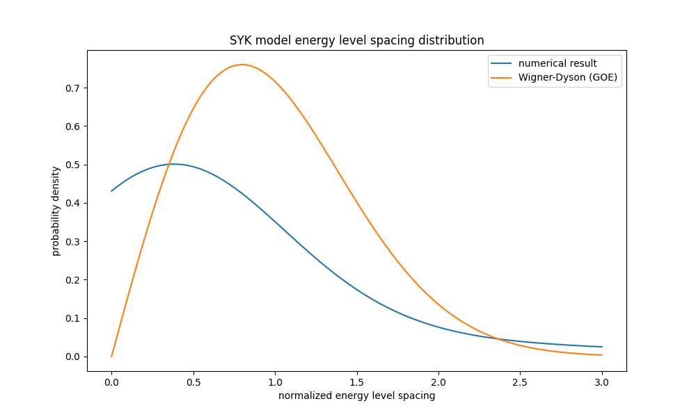

# Sachdev-Ye-Kitaev (SYK) 模型

SYK模型是一個量子多體系統的模型，以其在量子混沌和黑洞物理中的應用而聞名。

## 模型哈密頓量

SYK模型的哈密頓量可以寫作：

$$
H = \sum_{i<j<k<l} J_{ijkl} \chi_i \chi_j \chi_k \chi_l
$$

其中：
- $\chi_i$ 是 Majorana 費米子算符
- $J_{ijkl}$ 是隨機耦合常數，服從高斯分佈：

$$
\langle J_{ijkl} \rangle = 0, \quad \langle J_{ijkl}^2 \rangle = \frac{3!J^2}{N^3}
$$

## 主要特性

1. **混沌行為**：SYK模型表現出強烈的量子混沌行為，其out-of-time-order關聯函數（OTOC）呈指數衰減。

2. **熱化**：系統快速趨向熱平衡，並且其熵隨時間的演化符合一般的熱力學預期。

3. **黑洞對偶**：在大N極限下，SYK模型與二維近似AdS（反德西特）時空中的極端黑洞有對應關係。

4. **零溫熵**：模型具有非零的零溫熵，這是一個非常不尋常的特性。

5. **能譜統計**：能級間距分佈遵循隨機矩陣理論的預測，表現出能級排斥。這一特性可以通過以下方式進行分析：

   a) **能級間距分佈**：在混沌系統中，相鄰能級之間的間距通常遵循Wigner-Dyson分佈。對於SYK模型，由於其時間反演對稱性，其能級間距分佈應該遵循高斯正交系綜(GOE)的預測：

      $$P(s) = \frac{\pi}{2}s\exp(-\frac{\pi}{4}s^2)$$

      其中 $s$ 是無量綱化的能級間距。

   b) **能級排斥**：這意味著能級傾向於互相"推開"，而不是聚集在一起。這導致了小能級間距的概率減少。

   c) **r統計量**：定義為相鄰能級間距的比值：

      $$r_n = \frac{\min(s_n, s_{n+1})}{\max(s_n, s_{n+1})}$$

      其中 $s_n$ 是第n個無量綱化的能級間距。對於GOE系綜，<r>的理論值約為0.5359。

   d) **譜剛性**：這表示能譜在較大尺度上的波動比隨機能譜小。可以通過計算譜形式因子或數字方差來量化。

## 數值求解

求解SYK模型通常涉及以下步驟：

1. 生成隨機耦合常數 $J_{ijkl}$
2. 構建哈密頓量矩陣
3. 對角化哈密頓量以獲得能譜
4. 分析能譜統計和其他物理量

對於較大的系統（N > 32），通常需要使用更高級的數值方法，如Lanczos算法或張量網絡方法。

## 應用

SYK模型在以下領域有重要應用：

- 量子引力研究
- 黑洞信息悖論
- 非費米液體理論
- 量子混沌和熱化

## 能譜統計分析

在數值模擬中，我們通常通過以下步驟來分析SYK模型的能譜統計：

1. 計算系統的能譜（本徵值）。
2. 計算相鄰能級之間的間距。
3. 將能級間距除以平均間距，得到無量綱化的能級間距。
4. 繪製無量綱化能級間距的分佈，並與理論預測的Wigner-Dyson分佈進行比較。
5. 計算r統計量，並與GOE的理論值進行比較。

隨著系統大小N的增加，我們期望看到：
- 能級間距分佈越來越接近Wigner-Dyson分佈。
- r統計量的平均值越來越接近GOE的理論值0.5359。

這些特性的出現證實了SYK模型的量子混沌性質，並展示了其與隨機矩陣理論的深刻聯繫。


## 程式

```python
import numpy as np
from scipy.linalg import eigh
import matplotlib.pyplot as plt
from scipy.stats import gaussian_kde

def create_random_couplings(N, J):
    """create random couplings"""
    num_couplings = N * (N-1) * (N-2) * (N-3) // 24
    print(f"create {num_couplings} couplings")
    return np.random.normal(0, J/np.sqrt(N**3), size=num_couplings)

def create_hamiltonian(N, couplings):
    """create hamiltonian"""
    dim = 2**(N//2)  # Majorana fermion number is twice of normal fermion
    H = np.zeros((dim, dim), dtype=complex)
    
    coupling_idx = 0
    for i in range(N):
        for j in range(i+1, N):
            for k in range(j+1, N):
                for l in range(k+1, N):
                    J_ijkl = couplings[coupling_idx]
                    coupling_idx += 1
                    
                    # use Majorana fermion's Jordan-Wigner transform
                    for state in range(dim):
                        new_state = state
                        sign = 1
                        for m in [i//2, j//2, k//2, l//2]:
                            if m < N//2:
                                if state & (1 << m):
                                    sign *= -1
                                else:
                                    new_state ^= (1 << m)
                        
                        if i%2 == j%2 == k%2 == l%2:
                            sign *= 1j
                        
                        H[state, new_state] += J_ijkl * sign

    return H + H.conj().T  # ensure hamiltonian is hermitian

def solve_syk(N, J, return_eigenvectors=False):
    """solve syk model"""
    couplings = create_random_couplings(N, J)
    H = create_hamiltonian(N, couplings)
    
    if return_eigenvectors:
        eigenvalues, eigenvectors = eigh(H)
        return eigenvalues, eigenvectors
    else:
        eigenvalues = eigh(H, eigvals_only=True)
        return eigenvalues

# example
N = 20  # fermion number
J = 1.0  # coupling strength

try:
    eigenvalues = solve_syk(N, J)
    print("energy eigenvalues:")
    print(eigenvalues)

    # calculate energy spectrum statistics
    mean_level_spacing = np.mean(np.diff(sorted(eigenvalues)))
    print(f"mean level spacing: {mean_level_spacing}")

    # calculate energy spectrum standard deviation
    energy_std = np.std(eigenvalues)
    print(f"energy spectrum standard deviation: {energy_std}")
except Exception as e:
    print(f"error: {e}")

# calculate normalized energy level spacing
spacings = np.diff(sorted(eigenvalues))
normalized_spacings = spacings / np.mean(spacings)

# calculate r statistic
r_values = np.minimum(normalized_spacings[:-1], normalized_spacings[1:]) / np.maximum(normalized_spacings[:-1], normalized_spacings[1:])
r_mean = np.mean(r_values)
print(f"mean r value: {r_mean}")

# plot energy level spacing distribution
plt.figure(figsize=(10, 6))
kde = gaussian_kde(normalized_spacings)
x = np.linspace(0, 3, 100)
plt.plot(x, kde(x), label='numerical result')
plt.plot(x, np.pi/2 * x * np.exp(-np.pi/4 * x**2), label='Wigner-Dyson (GOE)')
plt.xlabel('normalized energy level spacing')
plt.ylabel('probability density')
plt.legend()
plt.title('SYK model energy level spacing distribution')
plt.show()
```
## The mean gap spacing plot

